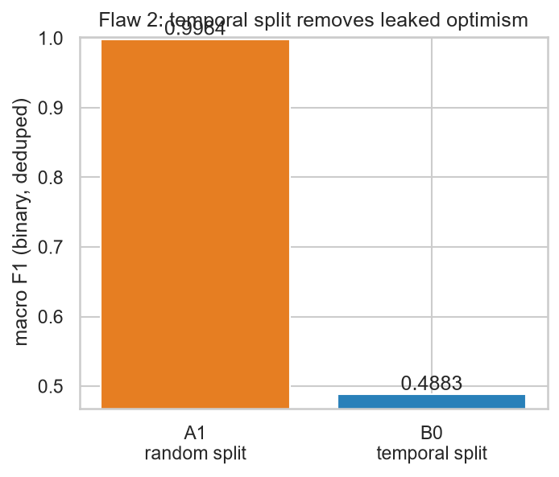
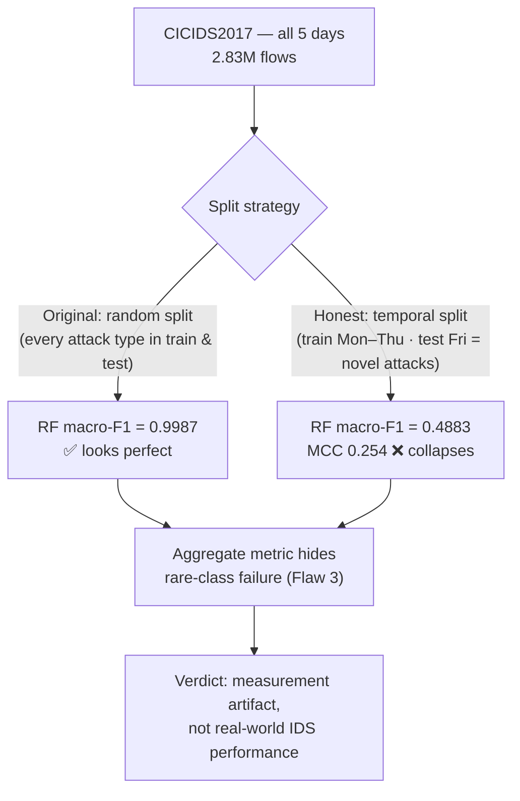

# 🛡️ Reproducing & Debunking "F1 > 0.999" on CICIDS2017


[](report/report.pdf)

> A critical reproduction study for **Data Science Methods in Cyber Security**
> (Dr. Uri Itai, University of Haifa). **Student:** Eyal Steinmetz.
> **Submission deadline:** Friday, 10 July 2026.

---

## TL;DR

A **peer-reviewed** paper (Rodríguez et al., 2022, *Sensors* MDPI) trains a Random Forest on
**CICIDS2017** and reports **F1 > 0.999**. We reproduce that number in Python/scikit-learn —
then show it is an artifact of *evaluation design*, not detector quality.

| Evaluation | macro-F1 | Interpretation |
|---|---|---|
| **A0** — raw + random split *(their method)* | **0.9987** | ✅ reproduces the F1 > 0.999 headline |
| **A1** — deduplicated + random split | 0.9984 | duplicates barely matter (**+0.03 pp**) — *not* the lever |
| **B0** — deduplicated + **temporal** split *(honest)* | **0.4883** | ❌ collapses; **−51 pp**, MCC just 0.254 |
| Per-class recall on rare attacks | ≈ 0 | ❌ PortScan/Botnet undetected; rare classes un-evaluable |

**Verdict:** the F1 > 0.999 claim is **reproducible but not supported** as evidence of a
deployable detector. Under an honest temporal split it collapses — because 100 % of the test
day's attacks are classes the model never saw in training. 📄 **[Read the full report (PDF)](report/report.pdf)**.

---

## The Critique in One Picture



*Binary macro-F1 under a random split vs. an honest temporal split — a 51-percentage-point gap
that the original methodology hides.*



The three flaws (each tested with our own experiment, citing Engelen et al. 2021):

1. **Duplicate contamination** — CICIDS2017 has ~307k duplicate flows. A leakage decomposition
   shows leaked and unique test rows are *equally* easy ⇒ duplicates are a data-quality footnote,
   **not** the inflation lever (binary F1 moves only +0.03 pp).
2. **Temporal-split violation** — a random split mixes Mon→Fri traffic. A real IDS only sees
   *past* traffic. Under a temporal split (train Mon–Thu, test Fri) macro-F1 drops **51 pp**,
   because Friday's attacks (DDoS, PortScan, Botnet) are classes unseen in training.
3. **Aggregate metrics hide rare-class failure** — Heartbleed/Infiltration/SQL Injection have
   only 2–7 evaluable samples; a single macro number conceals that they are effectively undetected.

---

## What We Did

1. **Reproduced** the source pipeline (random split on raw data) → confirmed macro-F1 = 0.9987.
2. **Isolated Flaw 1** (deduplicate + identical random split) and a leakage decomposition.
3. **Applied an honest temporal split** (train Mon–Thu, test Fri) + train-only SMOTE.
4. **Trained three models** under the honest protocol: Random Forest, XGBoost, and an
   unsupervised Isolation Forest.
5. **Full recall-aware metric suite** (precision, recall, F₁, F-beta(2), MCC, ROC-AUC, PR-AUC)
   + per-class confusion analysis + a SOC cost framing.

📓 **Notebook:** [`notebooks/ids_cicids2017_critique.ipynb`](notebooks/ids_cicids2017_critique.ipynb)
 · 📄 **Report:** [`report/report.pdf`](report/report.pdf)
 · 📊 **Metrics (source of truth):** [`notebooks/metrics_export.json`](notebooks/metrics_export.json)

---

## Repository Structure

```
.
├── README.md                         this file
├── notebooks/
│   ├── ids_cicids2017_critique.ipynb analysis (loading → EDA → FE → models → evaluation)
│   └── metrics_export.json           every reported number (report reads from here)
├── report/
│   ├── report.tex                    LaTeX source
│   └── report.pdf                    final report (13 pages)
├── figures/                          16 generated plots (PNG)
├── references/                       source_article.md, dataset_inventory.md, papers
├── pyproject.toml / uv.lock          dependencies (uv) + ruff config
├── LICENSE                           MIT
└── data/                             ⛔ git-ignored — place CICIDS2017 CSVs here
```

---

## Reproducing the Analysis

**Tooling:** [`uv`](https://docs.astral.sh/uv/) for environments, `ruff` for linting.
All randomness is fixed via `RANDOM_STATE = 42`; the notebook runs top-to-bottom with no
errors or warnings.

```bash
# 1. install the pinned environment
uv sync

# 2. place the dataset (see "Getting the Data" below)

# 3a. run the notebook interactively
uv run jupyter lab notebooks/ids_cicids2017_critique.ipynb

# 3b. or run it head-to-tail non-interactively (writes outputs + figures)
cd notebooks && uv run jupyter nbconvert --to notebook --execute --inplace \
    --ExecutePreprocessor.timeout=-1 ids_cicids2017_critique.ipynb

# 4. lint (expect: All checks passed!)
uv run ruff check .
```

> **Note:** the full run trains on 2.83M rows and takes ~25–30 min on a typical laptop CPU.

### Rebuilding the PDF (optional)

The report is built with **MiKTeX** / `pdflatex` (no Pandoc needed):

```bash
cd report && pdflatex report.tex && pdflatex report.tex   # 2 passes (ToC + cross-refs)
```

---

## Getting the Data (manual step)

The dataset is large (~844 MB extracted) and **not** committed. Download the
**MachineLearningCVE** CSVs and place the **8** day-files here:

```
data/MachineLearningCVE/
├── Monday-WorkingHours.pcap_ISCX.csv
├── Tuesday-WorkingHours.pcap_ISCX.csv
├── Wednesday-workingHours.pcap_ISCX.csv               # note: lowercase "workingHours"
├── Thursday-WorkingHours-Morning-WebAttacks.pcap_ISCX.csv
├── Thursday-WorkingHours-Afternoon-Infilteration.pcap_ISCX.csv
├── Friday-WorkingHours-Morning.pcap_ISCX.csv
├── Friday-WorkingHours-Afternoon-PortScan.pcap_ISCX.csv
└── Friday-WorkingHours-Afternoon-DDos.pcap_ISCX.csv
```

The loader matches files by weekday prefix (case-insensitive), totalling 2,830,743 flows.

- **Kaggle (used here):** [`chethuhn/network-intrusion-dataset`](https://www.kaggle.com/datasets/chethuhn/network-intrusion-dataset)
- **Official source:** [UNB CIC — IDS 2017](https://www.unb.ca/cic/datasets/ids-2017.html)

---

## Source Under Review & References

**Source article (the work we critique):**
Rodríguez, M., Alesanco, Á., Mehavilla, L., & García, J. (2022).
*Evaluation of Machine Learning Techniques for Traffic Flow-Based Intrusion Detection.*
**Sensors**, 22(23), 9326. MDPI. DOI: [10.3390/s22239326](https://doi.org/10.3390/s22239326).

> **Original code repository:** none. The paper's experiments were run in **Weka** (Java GUI)
> with no public code release, so we re-implemented their pipeline in Python/scikit-learn — which
> also makes the claim independently falsifiable. See [`references/source_article.md`](references/source_article.md).

**Counter-evidence & background:**
- Engelen, G., Rimmer, V., & Joosen, W. (2021). *Troubleshooting an Intrusion Detection Dataset:
  the CICIDS2017 Case Study.* IEEE SPW, 7–12.
- Lanvin, M. et al. (2022). *Errors in the CICIDS2017 Dataset…* CRiSIS 2022.
- Sharafaldin, I. et al. (2018). *Toward Generating a New Intrusion Detection Dataset…* ICISSP 2018.

```bibtex
@article{rodriguez2022evaluation,
  title   = {Evaluation of Machine Learning Techniques for Traffic Flow-Based Intrusion Detection},
  author  = {Rodr\'iguez, Mar\'ia and Alesanco, \'Alvaro and Mehavilla, Lorena and Garc\'ia, Jos\'e},
  journal = {Sensors}, volume = {22}, number = {23}, pages = {9326}, year = {2022},
  publisher = {MDPI}, doi = {10.3390/s22239326}
}
@inproceedings{engelen2021troubleshooting,
  title   = {Troubleshooting an Intrusion Detection Dataset: the CICIDS2017 Case Study},
  author  = {Engelen, Gints and Rimmer, Vera and Joosen, Wouter},
  booktitle = {2021 IEEE Security and Privacy Workshops (SPW)}, pages = {7--12}, year = {2021},
  doi = {10.1109/SPW53761.2021.00009}
}
```

---

## Author & License

**Eyal Steinmetz** — Data Science Methods in Cyber Security, University of Haifa.
Released under the [MIT License](LICENSE). The CICIDS2017 dataset and all cited works belong to
their respective authors.
